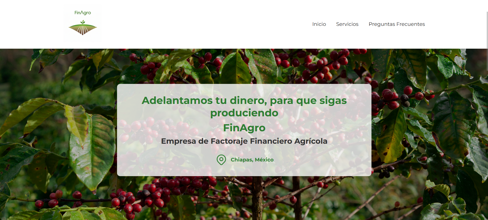
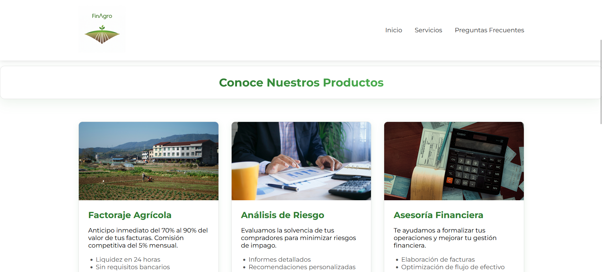
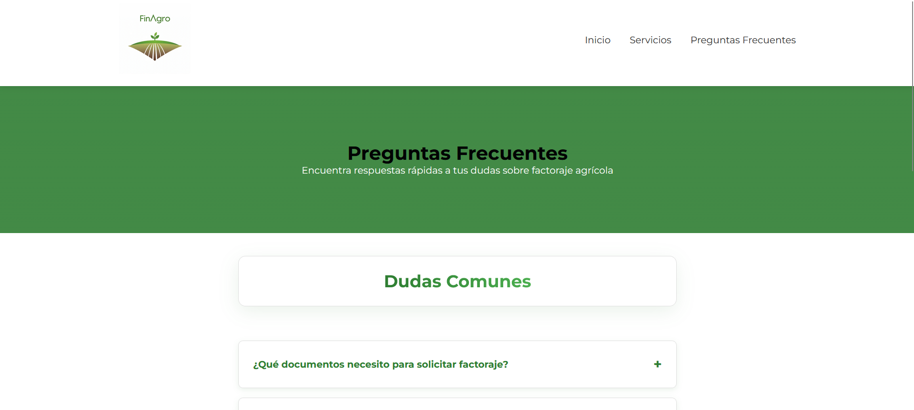
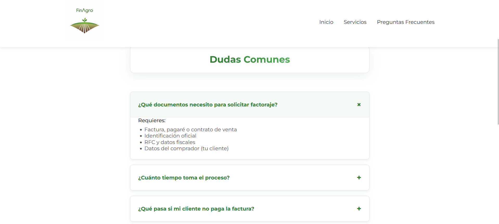
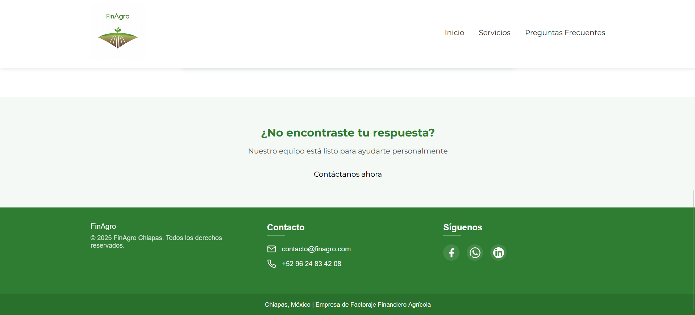

<h1>FinAgro</h1>

## Arquitectura

- Aplicación web multipágina desarrollada con HTML, CSS y JavaScript.
- Estructura modular mediante páginas independientes para Inicio, Servicios, FAQ y Nosotros.
- Componentes reutilizados para navegación y footer.
- Diseño responsive adaptable a dispositivos móviles y escritorio.
- Animaciones basadas en IntersectionObserver para mejorar la experiencia de usuario.

## Problemas resueltos

- Implementación de navegación adaptable para diferentes tamaños de pantalla.
- Organización de contenido financiero complejo en una interfaz sencilla.
- Optimización de experiencia móvil mediante diseño responsive.
- Desarrollo de secciones interactivas sin uso de frameworks externos.
- Reutilización de componentes para facilitar mantenimiento del proyecto.

## Tecnologías

- HTML5
- CSS3
- JavaScript
- Git
- GitHub Pages

## Capturas

### Inicio

### Demo
https://rizesan.github.io/FinAgro/

### Servicios

### FAQ

### Footer

## Aprendizajes

- Organización de estructura HTML semántica.
- Diseño responsive con CSS.
- Implementación de efectos hover y navegación.
- Desarrollo de interfaces enfocadas en experiencia de usuario.

